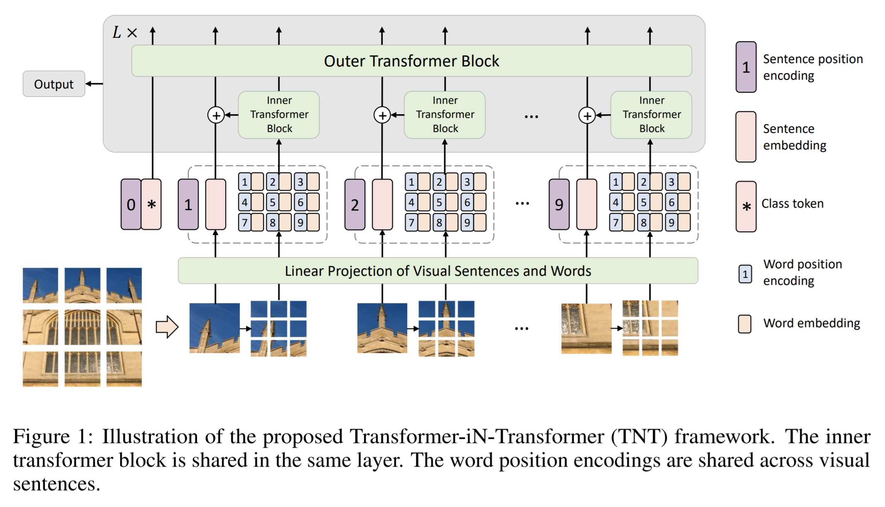

# Transformer-in-Transformer [](https://twitter.com/intent/tweet?text=Wow:&url=https%3A%2F%2Fgithub.com%2FRishit-dagli%2FTransformer-in-Transformer)


[](https://colab.research.google.com/github/Rishit-dagli/Transformer-in-Transformer/blob/main/training.ipynb)
[](https://github.com/Rishit-dagli/Transformer-in-Transformer/actions/workflows/tests.yml)
[](https://github.com/Rishit-dagli/Transformer-in-Transformer/actions/workflows/python-publish.yml)
[](https://github.com/psf/black)

[](https://codecov.io/gh/Rishit-dagli/Transformer-in-Transformer)

[](https://github.com/Rishit-dagli/Transformer-in-Transformer/stargazers)
[](https://github.com/Rishit-dagli)
[](https://twitter.com/intent/follow?screen_name=rishit_dagli)

An Implementation of the [Transformer in Transformer](https://arxiv.org/abs/2103.00112)
paper by Han et al. for image classification, attention inside local patches.
**Transformer in Transformer** uses pixel level attention paired with patch
level attention for image classification, in TensorFlow.



[PyTorch Implementation](https://github.com/lucidrains/transformer-in-transformer)

## Installation

Run the following to install:

```sh
pip install tnt-tensorflow
```

## Developing tnt-tensorflow

To install `tnt-tensorflow`, along with tools you need to develop and test, run the following in your virtualenv:

```sh
git clone https://github.com/Rishit-dagli/Transformer-in-Transformer.git
# or clone your own fork

cd tnt
pip install -e .[dev]
```

To run rank and shape tests run the following:

```
pytest -v --disable-warnings --cov
```

## Usage

```py
import tensorflow as tf
from tnt import TNT

tnt = TNT(
    image_size=256,  # size of image
    patch_dim=512,  # dimension of patch token
    pixel_dim=24,  # dimension of pixel token
    patch_size=16,  # patch size
    pixel_size=4,  # pixel size
    depth=5,  # depth
    num_classes=1000,  # output number of classes
    attn_dropout=0.1,  # attention dropout
    ff_dropout=0.1,  # feedforward dropout
)

img = tf.random.uniform(shape=[5, 3, 256, 256])
logits = tnt(img) # (5, 1000)
```

An end to end training example for image classification on a dataset can be found in the [training.ipynb](training.ipynb) notebook.

## Pre-trained model

The pre-trained model for TNT-S variant (reproducing the paper results, 81.4% top-1 accuracy and 95.7% top-5 accuracy on ImageNet-1K) can also be found paired with an example of inferencing with it.

| Model | TensorFlow Hub | Inference Tutorial |
| :---: | :------------: | :----------------: |
| [bucket](https://storage.googleapis.com/hub-models.appspot.com/tnt/tnt_s_patch16_224.tar.gz) | [tfhub.dev](https://tfhub.dev/rishit-dagli/tnt-s/) | [](https://colab.research.google.com/github/Rishit-dagli/Transformer-in-Transformer/blob/main/example/pre_trained_model.ipynb) |

## Want to Contribute 🙋‍♂️?

Awesome! If you want to contribute to this project, you're always welcome! See [Contributing Guidelines](CONTRIBUTING.md). You can also take a look at [open issues](https://github.com/Rishit-dagli/Transformer-in-Transformer/issues) for getting more information about current or upcoming tasks.

## Want to discuss? 💬

Have any questions, doubts or want to present your opinions, views? You're always welcome. You can [start discussions](https://github.com/Rishit-dagli/Transformer-in-Transformer/discussions).

## Citation

```bibtex
@misc{han2021transformer,
      title={Transformer in Transformer}, 
      author={Kai Han and An Xiao and Enhua Wu and Jianyuan Guo and Chunjing Xu and Yunhe Wang},
      year={2021},
      eprint={2103.00112},
      archivePrefix={arXiv},
      primaryClass={cs.CV}
}
```

## License

```
Copyright 2020 Rishit Dagli

Licensed under the Apache License, Version 2.0 (the "License");
you may not use this file except in compliance with the License.
You may obtain a copy of the License at

    http://www.apache.org/licenses/LICENSE-2.0

Unless required by applicable law or agreed to in writing, software
distributed under the License is distributed on an "AS IS" BASIS,
WITHOUT WARRANTIES OR CONDITIONS OF ANY KIND, either express or implied.
See the License for the specific language governing permissions and
limitations under the License.
```
